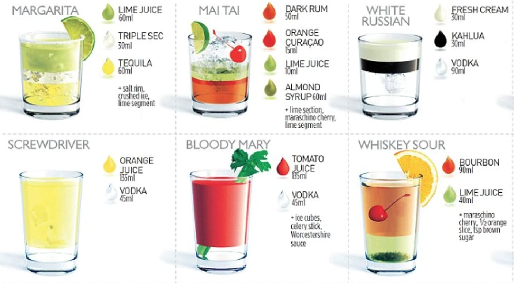

# Cocktail Recipies

# User Story
As a person who has an active social life and who has frequent guests visiting, I want to be able to use an app where I can look for ingredients I have at home, so I can prepare different drinks for my guests.

## Table of Contents 

- [Usage](#usage)
- [Mock-Up](#mock-up)
- [Finished Product](#finished-product)
- [Credits](#credits)
- [Specific First Tasks Assigned](#specific-first-tasks-assigned)
- [Roles for Contributors](#roles-for-contributors)
- [APIs Used](#apis-used)
- [License](#license)

## Usage
1. Open the  cocktail app. From the  drop down menu displayed at the top of the application, select the ingredients you would like to use to prepare your drink.

2. Click on the search button.

3. The application will return many differnet drinks recipies that include the ingredients you selected.

4. Click on the "clear button" to start a new search

## Mock-Up

The following image add demonstrates the application functionality:

## Finished-product

Here is the link of the finished work: 

[Deployed website](#)|

## Credits

Matt Goldsmith, Allan Elias, Saeed Elmakki, Angelica Ibarra |

[TheCocktailDB ](https://www.thecocktaildb.com/) |
[Array.from() Tutorial ](https://developer.mozilla.org/en-US/docs/Web/JavaScript/Reference/Global_Objects/Array/from) |
[Array.prototype.push() Tutorial ](https://developer.mozilla.org/en-US/docs/Web/JavaScript/Reference/Global_Objects/Array/push) |
[TheCocktailDB ](https://www.thecocktaildb.com/) |

## Specific-First-Tasks-Assigned

Matt Goldsmith - HTML and CSS skeleton

Allan Elias - Looking into APIs and testing them

Saeed Elmakki - Presentation

Angelica Ibarra - README

## Roles-for-Contributors

Matt Goldsmith - 

Allan Elias - 

Saeed Elmakki - 

Angelica Ibarra - 

## APIs-used

[TheCocktailDB ](https://www.thecocktaildb.com/) |

## License

MIT License

Copyright (c) 2022 Matt Goldsmith, Allan Elias, Saeed Elmakki, Angelica Ibarra

Permission is hereby granted, free of charge, to any person obtaining a copy
of this software and associated documentation files (the "Software"), to deal
in the Software without restriction, including without limitation the rights
to use, copy, modify, merge, publish, distribute, sublicense, and/or sell
copies of the Software, and to permit persons to whom the Software is
furnished to do so, subject to the following conditions:

The above copyright notice and this permission notice shall be included in all
copies or substantial portions of the Software.

THE SOFTWARE IS PROVIDED "AS IS", WITHOUT WARRANTY OF ANY KIND, EXPRESS OR
IMPLIED, INCLUDING BUT NOT LIMITED TO THE WARRANTIES OF MERCHANTABILITY,
FITNESS FOR A PARTICULAR PURPOSE AND NONINFRINGEMENT. IN NO EVENT SHALL THE
AUTHORS OR COPYRIGHT HOLDERS BE LIABLE FOR ANY CLAIM, DAMAGES OR OTHER
LIABILITY, WHETHER IN AN ACTION OF CONTRACT, TORT OR OTHERWISE, ARISING FROM,
OUT OF OR IN CONNECTION WITH THE SOFTWARE OR THE USE OR OTHER DEALINGS IN THE
SOFTWARE.

