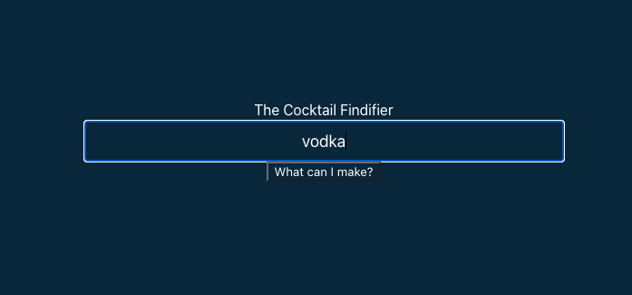
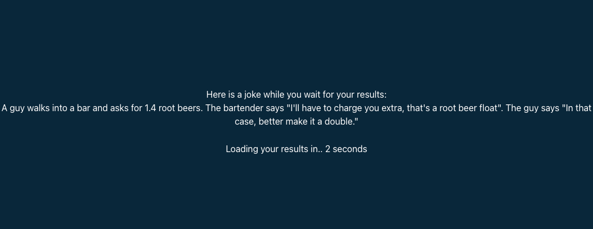
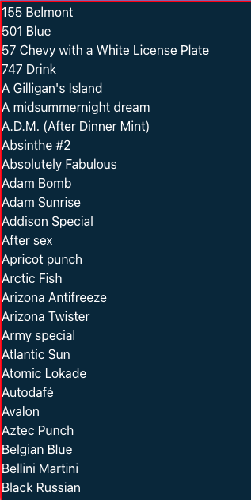
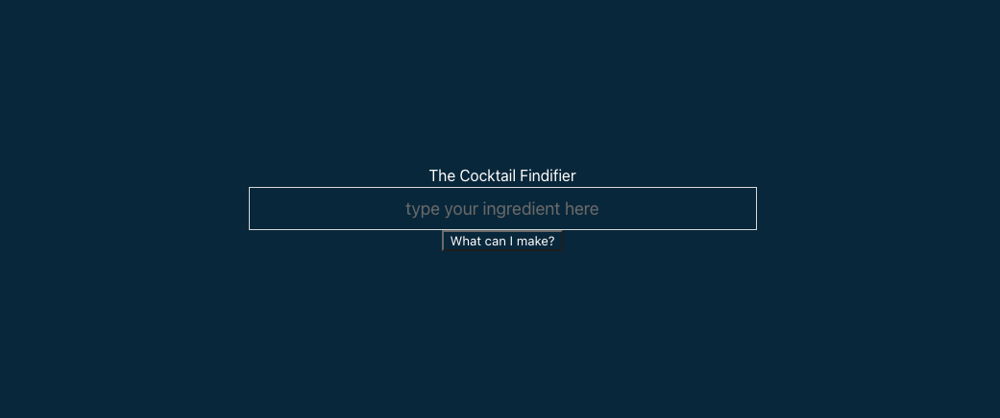

# Cocktail Recipies

# User Story
As a person who has an active social life and who has frequent guests visiting, I want to be able to use an app where I can look for ingredients I have at home, so I can prepare different drinks for my guests.

## Table of Contents 

- [Usage](#usage)
- [Mock-Up](#mock-up)
- [Finished Product](#finished-product)
- [Credits](#credits)
- [Specific-Project-tasks](#specific-project-tasks)
- [APIs Used](#apis-used)
- [License](#license)

## Usage
1. Open the  cocktail app. In the search bar, enter the ingredients you would like to use to prepare your drink.
Click on the "what can I make?" button.

3. The application will display a joke while the userwaits for their results with the many differnet drinks that incude the ingredients you selected.

4. When the timer is over, a list with the suggested drinks will appear. 

## Mock-Up

The following image shows the finished product

## Finished-product

Here is the link of the finished work: 

[Deployed website](https://chocochip287.github.io/cocktail-recipes/)|

## Credits

Matt Goldsmith, Allan Elias, Angelica Ibarra, Saeed Elmakki|

[TheCocktailDB ](https://www.thecocktaildb.com/) |
[JokeAPI ](https://v2.jokeapi.dev/) |
[Array.from() Tutorial ](https://developer.mozilla.org/en-US/docs/Web/JavaScript/Reference/Global_Objects/Array/from) |
[Array.prototype.push() Tutorial ](https://developer.mozilla.org/en-US/docs/Web/JavaScript/Reference/Global_Objects/Array/push) |
[TheCocktailDB ](https://www.thecocktaildb.com/) |

## Specific-Project-tasks

Matt Goldsmith -  Project structure, technical organization, and stylization -
 connected the app's individual elements into a cohesive and functional user experience with supporting JavaScript functions and uniform presentation

Allan Elias - API call setup, local storage management/rendering and general debugging - got access to the API's used on the project, 
setup the local storage to access drink search history through a dropdown menu and fixed some styling bugs.

Angelica Ibarra - README Initiation and maintainence. Queried an API to pull jokes connecting programming to drinks, bartending and mixology and render them into a usable format for the app. 
Implemented the jokee data into leading/transition screen via HTML and JavaScript to introduce humor and levity into the user's experience.

Saeed Elmakki - Initial HTML draft and Final Presentation.

## APIs-used

[TheCocktailDB ](https://www.thecocktaildb.com/) |
[JokeAPI ](https://v2.jokeapi.dev/) 

## License

MIT License

Copyright (c) 2022 Matt Goldsmith, Allan Elias, Angelica Ibarra, Saeed Elmakki

Permission is hereby granted, free of charge, to any person obtaining a copy
of this software and associated documentation files (the "Software"), to deal
in the Software without restriction, including without limitation the rights
to use, copy, modify, merge, publish, distribute, sublicense, and/or sell
copies of the Software, and to permit persons to whom the Software is
furnished to do so, subject to the following conditions:

The above copyright notice and this permission notice shall be included in all
copies or substantial portions of the Software.

THE SOFTWARE IS PROVIDED "AS IS", WITHOUT WARRANTY OF ANY KIND, EXPRESS OR
IMPLIED, INCLUDING BUT NOT LIMITED TO THE WARRANTIES OF MERCHANTABILITY,
FITNESS FOR A PARTICULAR PURPOSE AND NONINFRINGEMENT. IN NO EVENT SHALL THE
AUTHORS OR COPYRIGHT HOLDERS BE LIABLE FOR ANY CLAIM, DAMAGES OR OTHER
LIABILITY, WHETHER IN AN ACTION OF CONTRACT, TORT OR OTHERWISE, ARISING FROM,
OUT OF OR IN CONNECTION WITH THE SOFTWARE OR THE USE OR OTHER DEALINGS IN THE
SOFTWARE.

